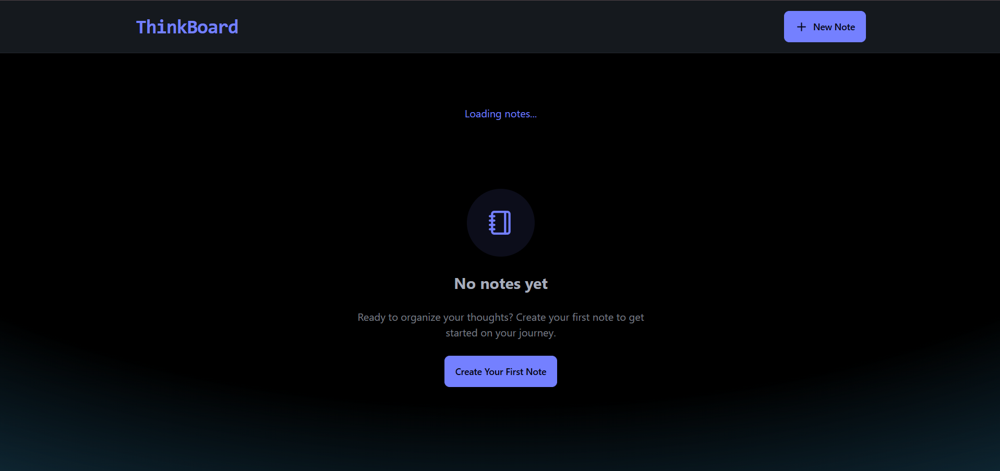
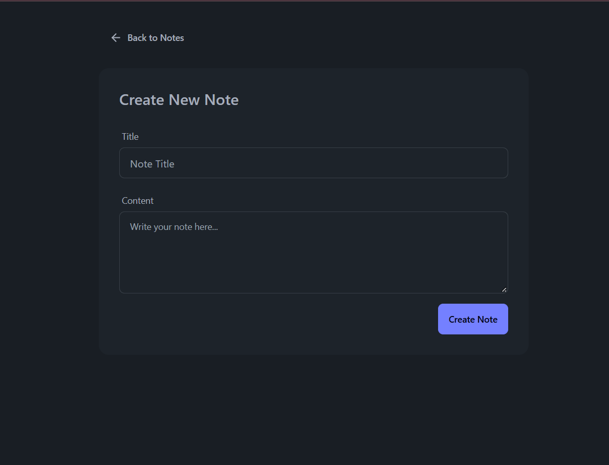
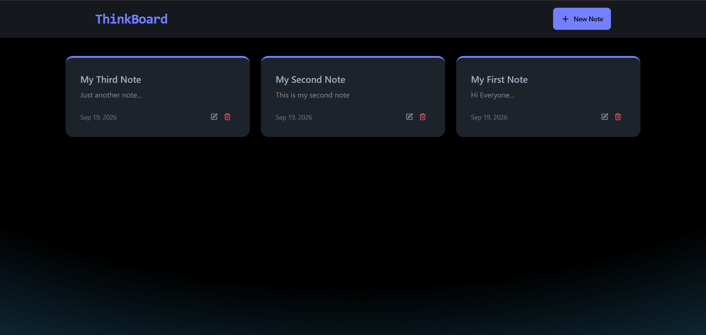

# ThinkBoard

A full-stack notes app built with the MERN stack. Create, view, edit, and delete notes from a clean, responsive interface.

**Live demo:**
(https://mern-thinkboard-j4aeonrendercom/)

> Hosted on Render's free tier, so the first load after a period of inactivity can take up to a minute.

## Screenshots

| Home | Create note | Note detail |
| ---- | ----------- | ----------- |
|  |  |  |

## Features

- Create, view, edit, and delete notes
- Notes sorted newest first
- Dedicated note detail page
- Toast notifications for success and error feedback
- Rate limiting with Upstash Redis to protect the API
- Responsive UI styled with Tailwind CSS and daisyUI
- Production build of the frontend served by the Express backend

## Tech Stack

**Frontend:** React (Vite), React Router, Axios, Tailwind CSS, daisyUI, react-hot-toast, lucide-react

**Backend:** Node.js, Express 5, MongoDB (Mongoose), Upstash Redis (rate limiting)

**Deployment:** Render

## Project Structure

```
MERN-THINKBOARD/
├── backend/
│   └── src/
│       ├── config/        # database connection
│       ├── controllers/   # route handlers
│       ├── middleware/    # rate limiter
│       ├── models/        # Mongoose schemas
│       ├── routes/        # API routes
│       └── server.js
├── frontend/
│   └── src/
│       ├── components/
│       ├── lib/           # axios instance and helpers
│       ├── pages/
│       ├── App.jsx
│       └── main.jsx
└── package.json
```

## Getting Started

### Prerequisites

- Node.js 18 or newer
- A MongoDB database (a free [MongoDB Atlas](https://www.mongodb.com/atlas) cluster works)

### 1. Clone the repository

```bash
git clone https://github.com/fahma-rizan/mern-thinkboard
cd your-repo-name
```

### 2. Set up environment variables

Create a `.env` file inside the `backend` folder. Use the same variable names as `backend/.env.example`:

```
MONGO_URI=your_mongodb_connection_string
PORT=5001

UPSTASH_REDIS_REST_URL=your_upstash_redis_rest_url
UPSTASH_REDIS_REST_TOKEN=your_upstash_redis_rest_token

NODE_ENV=development
```

Rate limiting uses Upstash Redis. Create a free database at [upstash.com](https://upstash.com) to get the URL and token.

### 3. Install dependencies

```bash
cd backend
npm install

cd ../frontend
npm install
```

### 4. Run in development

Open two terminals.

```bash
# Terminal 1: backend (http://localhost:5001)
cd backend
npm run dev
```

```bash
# Terminal 2: frontend (http://localhost:5173)
cd frontend
npm run dev
```

Then open http://localhost:5173.

## API Endpoints

| Method | Endpoint         | Description         |
| ------ | ---------------- | ------------------- |
| GET    | `/api/notes`     | Get all notes       |
| GET    | `/api/notes/:id` | Get a note by ID    |
| POST   | `/api/notes`     | Create a new note   |
| PUT    | `/api/notes/:id` | Update a note       |
| DELETE | `/api/notes/:id` | Delete a note       |

## Production Build

In production, the Express server serves the built frontend.

```bash
npm run build   # installs dependencies and builds the frontend
npm run start   # starts the backend, which serves frontend/dist
```

Set `NODE_ENV=production` along with your other environment variables on your hosting platform. On Render, use the build and start commands above and add the variables under **Environment**.

## Author

**Fahma Rizan**
[LinkedIn](https://www.linkedin.com/in/fahmarizan)